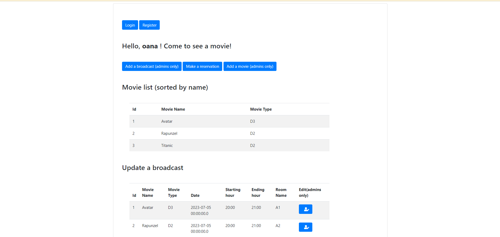
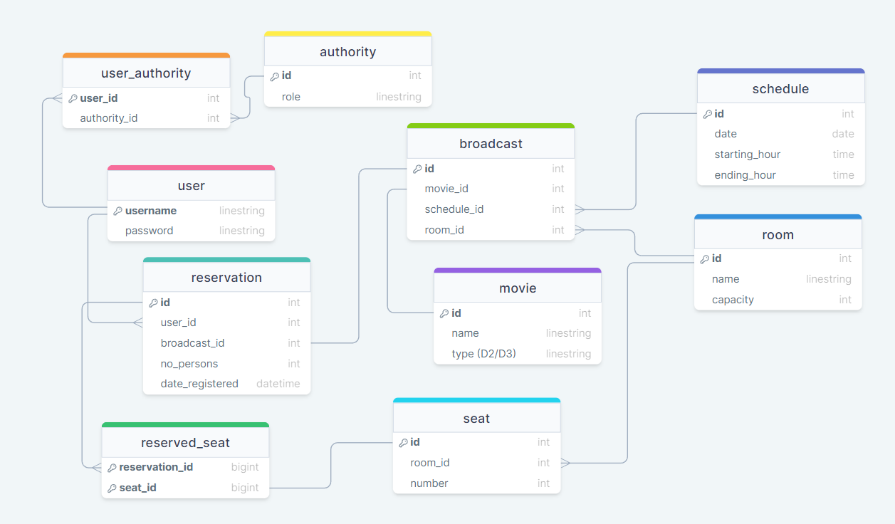
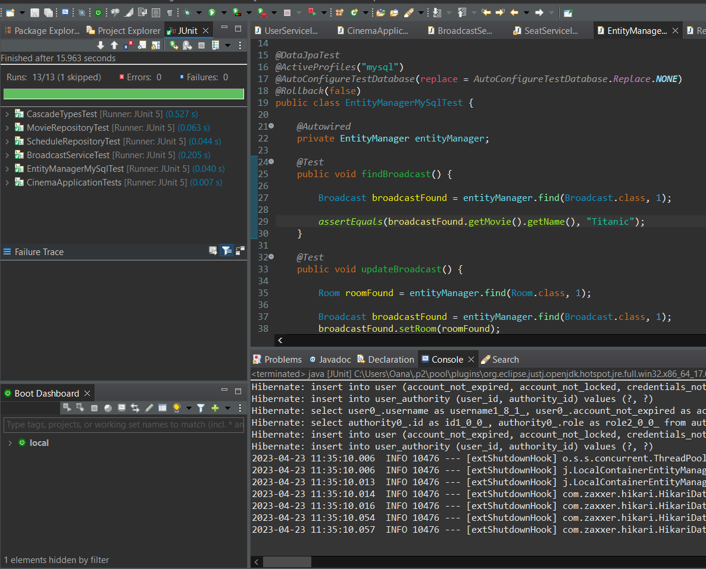

# :cinema: Platforma pentru management-ul rezervarilor la cinema 



### :clipboard:  Baza de date - entitati


## Aplicația va îndeplini cerințele următoare.
:white_check_mark: Vor fi create relații între entități de toate tipurile: @OneToOne, @OneToMany, @ManyToOne, @ManyToMany.

   @OneToOne 
   - Reservation - Broadcast
  
   @OneToMany
   - Movie - Broadcast
   - Room - Seat
   - Room - Broadcast
   - Schedule - Broadcast
  
   @ManyToOne
   - Broadcast - Room
   - Broadcast - Schedule
   - Broadcast - Movie
   - Reservation - User
   - Seat - Room
  
   @ManyToMany
   - Reservation - Seat (reserved_seat)
   - User - Authority (user_authority)

:white_check_mark: Vor fi implementate toate tipurile de operații CRUD.
### CREATE
	- (Admins only)Adaugare film la lista de filme
	- (Admins only) Adaugare programare film(broadcast) la o anumita data, ora, intr-o anumita sala
	- Adugare user (inregistrare cu username si parola)
	- Adaugare rezervare facuta de un user la un anumit film programat(broadcast)
### UPDATE
    - (Admins only) Modificarea unei programari a unui film (schimbare film, program, sala) 
### GET
	- Afisare lista filme pagina principala
	- Afisare lista programari cu toate informatiile pagina principala
	- Afisare lisat rezervari user curent pagina principala
	- Alte informatii extra pe paginile secundare
### DELETE
    - Anularea unei rezervari
   
:ballot_box_with_check: Se va testa aplicația folosindu-se profiluri și două baze de date diferite, una dintre ele pentru etapa de testare. Se poate utiliza și o bază de date in-memory (H2).
   
:white_check_mark: Utilizare unit-tests/integration tests.


   
:white_check_mark: Se vor valida datele din formulare, se vor trata excepțiile.
   - Validare date formular - la adaugarea unui film, validarea numelui
  ```Java
  public class Movie {

	....

	@Size(min = 2, message = "*The name is too short!")
	@Size(max = 10, message = "*The name is too long (<=10 characters)!")
	private String name;

	...

  }
  ```
   - Tratarea exceptiilor - daca vreau sa editez o programare (broadcast) care nu exista redirectionare catre notFoundException.html (mesajul: 404 not found)
``` Java
public class BroadcastController {

	....

	@GetMapping("/edit/{id}")
	public String showUpdateForm(@PathVariable("id") int id, Model model) {
		...

		Optional<Broadcast> broadcast = broadcastRepository.findById(id);
		if (!broadcast.isPresent()) {

			throw new ResourceNotFoundException("Broadcast " + id + " not found");
		}

		...
	}

	@ResponseStatus(HttpStatus.NOT_FOUND)
	@ExceptionHandler(ResourceNotFoundException.class)
	public ModelAndView handlerNotFoundException(Exception exception) {
		ModelAndView modelAndView = new ModelAndView();
		modelAndView.getModel().put("exception", exception);
		modelAndView.setViewName("notFoundException");
		return modelAndView;
	}
	...

}
```
:white_check_mark: Se vor utiliza log-uri. Opțional aspecte.
```
2023-04-22 23:14:40.790  INFO 9848 --- [nio-8080-exec-6] c.b.cinema.configuration.LoggingAspect   : aspect log after List com.backend.cinema.services.ReservationServiceImpl.getAllReservationsByUsername(String)
2023-04-22 23:14:40.790  INFO 9848 --- [nio-8080-exec-6] c.b.cinema.configuration.LoggingAspect   : aspect log after ModelAndView com.backend.cinema.controllers.MainController.getHome(Model)
```
```Java
@Component
@Aspect
@Slf4j
public class LoggingAspect {
	...
	@After("logAnnotation()")
	public void logMethodCallAdvice(JoinPoint joinPoint) {
		log.info("aspect log after " + joinPoint.getSignature());
	}

	@Before("logPackage()")
	public void logPackageAdvice(JoinPoint joinPoint) {
		log.info("aspect log before " + joinPoint.getSignature());
	}

	@After("logMethod()")
	public void logSetterAdvice(JoinPoint joinPoint) {
		log.info("aspect log after " + joinPoint.getSignature());
		log.info("aspect log param " + joinPoint.getArgs()[0]);
	}
	...
}
```
:white_check_mark: Vor fi utilizate opțiuni de paginarea și sortarea a datelor.
- Afisarea filmelor in pagina principala ordonate alfabetic dupa nume
```Java
@Repository
public interface MovieRepository extends PagingAndSortingRepository <Movie, Integer>{ 

}
```
```Java
@Controller
public class MainController {
	...
	
	@Log
	@GetMapping("/main")
	public String showMainPage(Model model) {
		...
		
		List<Movie> movies = new ArrayList<>();
		movieRepository.findAll(Sort.by("name")).iterator().forEachRemaining(movies::add);
		model.addAttribute("movies", movies);
		
		...

		return "main";
	}

	...
}
```
   
:white_check_mark: Se va include Spring Security (cerința minima autentificare jdbc).
- Sistem de login si inregistrare
  ```html
   <body>
      <div class="container" style="margin-top: 20px">
         <div class="col-md-6 col-md-offset-3">
            <form class="form-signin" method="post" th:action="perform_login">
               <h2 class="form-signin-heading">Sign in ....</h2>
               <p>
               <p th:if="${param.error}" class="text-danger">Invalid user or password</p>
               <label for="username" class="sr-only">Username</label>
               <input type="text" id="username" name="username" class="form-control" placeholder="Username" required autofocus>
               </p>
               <p>
                  <label for="password" class="sr-only">Password</label>
                  <input type="password" id="password" name="password" class="form-control" placeholder="Password" required>
               </p>
               <button class="btn btn-lg btn-primary btn-block" type="submit">Sign in</button>
               
               </br>
               
               <p> Don't have an account?
               	  <a class="btn btn-primary" href="/users/signup" >Register</a>
               </p>
            </form>
         </div>
      </div>
   </body>
  ```
- Permisiuni in functie de rolurile asociate
- Parola salvata criptata in baza de date 
  ```Java
  public class SecurityJpaConfig {

	....

	@Bean
	PasswordEncoder passwordEncoder() {
		return new BCryptPasswordEncoder();
	}

	@Bean
	SecurityFilterChain securityFilterChain(HttpSecurity http) throws Exception {
		return http.authorizeRequests(auth -> auth.antMatchers("/broadcasts").permitAll()
				.antMatchers("/auction").hasAnyRole().antMatchers("/broadcasts/**").hasRole("ADMIN")
				.antMatchers("/auction").hasAnyRole().antMatchers("/movies/**").hasRole("ADMIN")
				.antMatchers("/movies/add").hasRole("ADMIN").antMatchers("/login").permitAll()
				.antMatchers("/broadcasts/add").hasRole("ADMIN").antMatchers("/login").permitAll()
		// .anyRequest().authenticated()
		).userDetailsService(userDetailsService).formLogin().loginPage("/login").loginProcessingUrl("/perform_login")
				.and().exceptionHandling().accessDeniedPage("/access_denied").and().httpBasic(withDefaults()).build();
	}

  }
  ```
